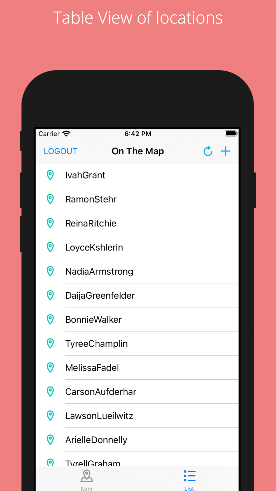

# On-The-Map

OnTheMap is a map app that lets a Udacity student to post a location and also view locations posted by other students. I learned the following skills  :

* Swift
* UIKit
* MapKit
* Networking using API calls

## App Features

1. Student can post a location along with a url.
2. Locations and urls posted by other students also appear in a MapView and a TableView.

## Implementation
The app contains 4 View Controllers: 
1. LoginViewController - It is a login view in which a Udacity student has to fill email and password to login or a user can click the Sign Up button to open the Udacity website in safari. 
2. MapViewController: It shows the user all the locations and urls posted by other Udacity students using Udacity and Parse API in a MapView using annotations.
3. ListViewController: It shows all the details shown by the MapViewController in a TableView.
4. InformationPostingViewController: It lets a student to post his own location and a url with it. It uses geocoding to convert the location string into longitude and latitude and shows the location on the map using that longitude and latitude before confirming to post the location.

## How to build/compile
1. Open "On the Map.xcodeproj" file.
2. Select appropriate simulator.
3. Click the run button or command + R to run the project.

## Requirements

1. Xcode 10.3
2. Swift 5

## APIs used 

1. Udacity API
2. Parse API

## Screenshots

 &nbsp; &nbsp;  &nbsp; &nbsp;  &nbsp; &nbsp;    &nbsp; &nbsp; 

## License
This code is free and open source and I have build this project for my Udacity submission.
